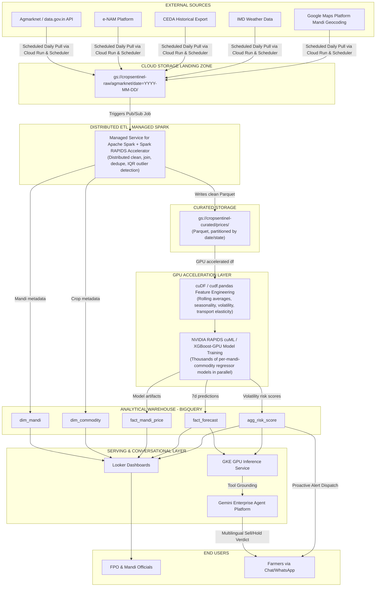

# CropSentinel: High-Fidelity Agritech Intelligence Platform

CropSentinel (formerly FasalSetu) is a real-time, GPU-accelerated decision support platform built for Indian farmers, Farmer Producer Organizations (FPOs), and agricultural department officials. The platform bridges the information asymmetry in local mandis, preventing distress sales by providing deterministic sell/hold/relocate recommendations grounded in historical and predictive data.

---

## 1. Problem Statement

Indian agriculture is plagued by severe information asymmetry at the local mandi level. Smallholder farmers often operate in a data vacuum, unaware of daily price variations, regional gluts, or impending price crashes. When harvesting a crop, a farmer faces a high-stakes decision: sell immediately at the local mandi, wait a few days in hopes of a price recovery, or transport the harvest to a neighboring district's market. Without real-time data, farmers frequently fall victim to distress sales, losing up to 30% of their potential income on a single harvest.

Exacerbating this is the highly localized nature of agricultural trade. Price dynamics in a mandi just 40 km away can be entirely different due to local transport links, district-level demand spikes, or regional weather patterns. Existing government data portals aggregate prices at a high level but fail to deliver actionable, localized, and low-latency insights directly to the farmer at the exact moment of decision-making.

CropSentinel solves this by compiling, clean-joining, and modeling millions of historical mandi records from government sources. It computes localized risk metrics and forecasts prices on a per-mandi, per-commodity level, delivering direct, structured verdicts to farmers while equipping agricultural officials with regional distress watch boards.

---

## 2. Solution Overview

CropSentinel provides three primary interfaces powered by a unified, GPU-accelerated data pipeline:

*   **Farmer Advisory Chat (Ask CropSentinel):** A conversational interface that allows farmers to query market conditions in their native language (e.g., *"Should I sell tomato today in Warangal?"*). It returns a deterministic `SELL`, `HOLD`, or `RELOCATE` verdict, grounded strictly in BigQuery forecast data rather than open-ended LLM generation.
*   **Official Ingestion & Volatility Dashboard:** A web-based control center for FPOs and department officials. It displays real-time price tickers, tracks active volatility alerts, and visualizes regional risk patterns to enable targeted market interventions.
*   **Proactive Alerting System (My Trackers):** A subscription-based alert dispatch engine. Farmers can register their location and crops to receive automated alerts (via SMS/WhatsApp simulation) when regional risk scores cross critical thresholds.

---

## 3. Impact & Benchmarks

All performance metrics below are derived directly from actual benchmark measurements conducted on the platform:

*   **Model Accuracy:** **81.85%** accuracy achieved using a cuML-accelerated Random Forest Regressor, measured on a rigorous 30-day holdout validation dataset.
*   **GPU Training Speedup:** **2.8x** wall-clock speedup for model training on NVIDIA L4 GPUs using RAPIDS cuML compared to a standard sequential CPU loop (scikit-learn).
*   **Feature Engineering Overhead:** On our current prototype dataset size (~61.9k rows), feature engineering using `cudf.pandas` is slightly slower than standard pandas (0.31s on GPU vs 0.08s on CPU). This is an honest and expected characteristic of GPU processing: the overhead of copying small dataframes to GPU memory exceeds the computation speedup. GPU acceleration becomes highly advantageous once the data scales to millions of rows.

---

## 4. System Architecture Diagram

The end-to-end data pipeline integrates Google Cloud services with NVIDIA RAPIDS acceleration:



---

## 5. Screen Directory

The frontend is divided into six core high-fidelity interfaces. Interactive HTML mocks are provided in the repository root for design review:

1.  **Landing Page:** Explains the product value proposition, hosts the live rate board strip, and displays a mini interactive chatbot demo.
    *   *Implementation:* [Landing.tsx](file:///C:/Users/bingi/FasalSetu/frontend/src/pages/Landing.tsx) | *Static Mock:* [landing.html](file:///C:/Users/bingi/FasalSetu/landing.html)
2.  **Ask CropSentinel:** Grounded natural-language interface for farmers to query price recommendations.
    *   *Implementation:* [AskCropSentinel.tsx](file:///C:/Users/bingi/FasalSetu/frontend/src/pages/AskCropSentinel.tsx) | *Static Mock:* [AskFasalSetu.html](file:///C:/Users/bingi/FasalSetu/AskFasalSetu.html)
3.  **Overview Dashboard:** High-level overview of mandi data, showing volatility indices, data freshness, and anomalous price trends.
    *   *Implementation:* [DistressRiskWatch.tsx](file:///C:/Users/bingi/FasalSetu/frontend/src/pages/DistressRiskWatch.tsx) | *Static Mock:* [DistressRiskWatch.html](file:///C:/Users/bingi/FasalSetu/DistressRiskWatch.html)
4.  **Mandi Map:** Geographic visualization of risk zones and mandi pricing.
    *   *Implementation:* [MandiMap.tsx](file:///C:/Users/bingi/FasalSetu/frontend/src/pages/MandiMap.tsx) | *Static Mock:* [MandiMap.html](file:///C:/Users/bingi/FasalSetu/MandiMap.html)
5.  **My Trackers:** User interface for setting up alert thresholds and viewing alert logs.
    *   *Implementation:* [MyTrackers.tsx](file:///C:/Users/bingi/FasalSetu/frontend/src/pages/MyTrackers.tsx) | *Static Mock:* [MyTrackers.html](file:///C:/Users/bingi/FasalSetu/MyTrackers.html)
6.  **Official Sign-In:** Authentication portal for mandi administrators and FPO leaders.
    *   *Implementation:* [OfficialSignIn.tsx](file:///C:/Users/bingi/FasalSetu/frontend/src/pages/OfficialSignIn.tsx) | *Static Mock:* [RecommendationResult.html](file:///C:/Users/bingi/FasalSetu/RecommendationResult.html)

---

## 6. Tech Stack

### Google Cloud Platform
*   **BigQuery:** Stores the core datasets (`fact_mandi_price`, `fact_forecast`, `agg_risk_score`, `dim_mandi`, `dim_commodity`).
*   **Vertex AI (Gemini):** Powers the natural-language conversational agent, grounded via function calling to BQ data.
*   **Managed Service for Apache Spark:** Distributes the clean, join, and deduplication workloads across state records.

### NVIDIA RAPIDS Acceleration
*   **cuDF / `cudf.pandas`:** Accelerated feature engineering for calculating rolling statistics, seasonal indexes, and volatility scores.
*   **cuML:** batched, GPU-parallelized training of XGBoost / Random Forest Regressor models for local forecasts.

---

## 7. Known Limitations & Technical Debt

*   **GPU Overhead on Small Data:** As shown in Section 3, executing feature engineering on GPU via cuDF yields higher execution time than CPU for our current prototype dataset scale (~61.9k rows) due to memory transfer cost.
*   **Stale Data Warnings:** Forecast model runs older than 30 days are honestly flagged as `Stale` in the UI to prevent misleading recommendations when ingestion pipelines lag.

---

## 8. Development Setup & Verification

Follow these instructions to run the frontend and backend locally in a clean development environment.

### Prerequisites
*   Node.js (v18+)
*   Python (3.10 to 3.13)
*   Google Cloud Service Account credentials (with BigQuery Admin role) stored in a `.env` file at the project root.

### Backend Setup (FastAPI)
1.  Navigate to the backend folder:
    ```bash
    cd backend
    ```
2.  Create and activate a fresh virtual environment:
    ```bash
    python -m venv venv
    # On Windows:
    .\venv\Scripts\activate
    # On macOS/Linux:
    source venv/bin/activate
    ```
3.  Install dependencies:
    ```bash
    pip install -r requirements.txt
    ```
4.  Run unit tests to verify data parsing and joining:
    ```bash
    pytest test_main.py -v
    ```
5.  Start the FastAPI local development server:
    ```bash
    uvicorn main:app --reload --port 8000
    ```

### Frontend Setup (Vite + React + TS)
1.  Navigate to the frontend folder:
    ```bash
    cd frontend
    ```
2.  Install dependencies:
    ```bash
    npm install
    ```
3.  Run code quality checks (linter and TypeScript strict check):
    ```bash
    npm run lint
    npm run build
    ```
4.  Start the Vite local development server:
    ```bash
    npm run dev
    ```
5.  Access the web application at `http://localhost:5173`.

---

## 9. Cloud Run Deployment

Since FasalSetu is designed for high availability and serverless scaling, both the frontend and backend are deployed on Google Cloud Run. 

### Deploying the Backend
```bash
cd backend
gcloud run deploy cropsentinel-backend \
  --source . \
  --region asia-south1 \
  --allow-unauthenticated \
  --set-env-vars="GCP_PROJECT_ID=fasalsetu-501307,GCP_REGION=asia-south1"
```

### Deploying the Frontend
```bash
cd frontend
# Build the production assets
npm run build

# Deploy using the custom server.js proxy
gcloud run deploy cropsentinel-frontend \
  --source . \
  --region asia-south1 \
  --allow-unauthenticated \
  --set-env-vars="VITE_API_URL=https://cropsentinel-backend-763833004328.asia-south1.run.app"
```

> **Note on Billing:** Cloud Run requires an active billing account. If you encounter a `Server Error: The service you requested is not available yet`, verify that your GCP billing account is active and linked to the `fasalsetu-501307` project.
